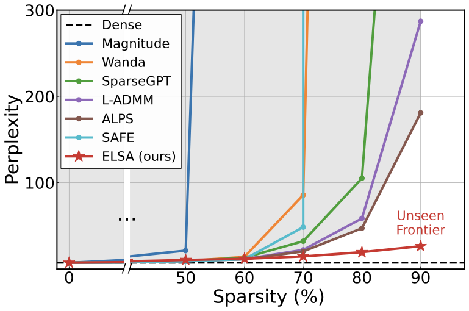
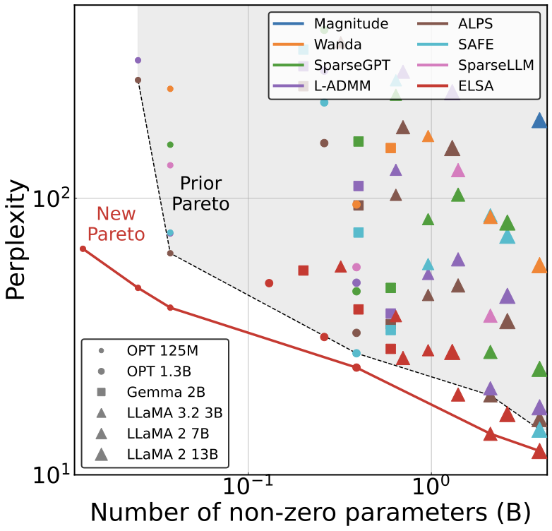

# ❄️👸🏼 ELSA: Extreme LLM Sparsity via surrogate-free ADMM

This repository provides the official codebase for our paper:

**The Unseen Frontier: Pushing the Limits of LLM Sparsity with Surrogate-Free ADMM**  
***Kwanhee Lee**, Hyeondo Jang, Dongyeop Lee, Dan Alistarh, Namhoon Lee*

### TL;DR: We achieve extreme LLM sparsity (up to 90%) via surrogate-free constrained optimization!

---

## Abstract

*This repository contains the official codebase for the paper "The Unseen Frontier: Pushing the Limits of LLM Sparsity with Surrogate-Free ADMM". Our work, ELSA, introduces a novel method to achieve extreme sparsity in Large Language Models (LLMs) by employing a surrogate-free Alternating Direction Method of Multipliers (ADMM). This allows for significant model compression without the need for surrogate objectives, pushing the boundaries of efficient LLM inference.*

---

## Key Results 

Below are some key results from our paper, demonstrating the effectiveness of ELSA.

| Figure 1: Sparsity-performance trade-off on LLaMA-2 7B. | Figure 3: New pareto-frontier with ELSA |
| :---: | :---: |
|  |  |

---

## 1. Setup

#### Venv setup
```bash
conda create -n elsa --python=3.10
conda activate elsa
pip install -r requirements.txt
```

## 2. Running Experiments

#### Baseline Pruning Methods
We support `[dense, sparsegpt, wanda, safe]` for baseline experiments.

**Dense Model (Zero Sparsity):**
```bash
python main.py \
    --model="google/gemma-2-2b" \
    --prune_method="dense" \
    --sparsity_ratio=0.0 \
    --seqlen=2048 \
    --seed=0
```

**W&P (50% Sparsity):**
```bash
python main.py \
    --model="google/gemma-2-2b" \
    --prune_method="wanda" \
    --sparsity_ratio=0.5 \
    --sparsity_type="unstructured" \
    --seqlen=2048 \
    --nsamples=128 \
    --dataset="c4" \
    --eval_zero_shot=True \
    --seed=0
```

#### ELSA (Our Method)
```bash
python main.py \
    --model="google/gemma-2-2b" \
    --prune_method="global_admm" \
    --sparsity_ratio=0.5 \
    --sparsity_type="unstructured" \
    --seqlen=2048 \
    --admm_steps=4096 \
    --admm_batch_size=2 \
    --admm_gradient_accumulation_steps=4 \
    --admm_lr=2e-4 \
    --admm_lmda=0.01 \
    --admm_interval=32 \
    --loss_type="ntp" \
    --eval_zero_shot=True \
    --seed=0
```

## 3. Multi-GPU Training

This project uses Hugging Face `accelerate` for multi-GPU training.

#### Configuration
First, configure `accelerate` for your environment. This will guide you through setting up your distributed training environment. Make sure to choose **FSDP** (`Fully Sharded Data Parallel`) when prompted, as our pipeline is optimized for it.
```bash
accelerate config
```
Example configurations used for our paper can be found in the `/config` directory.

#### Launching
Once configured, you can launch a training script using `accelerate launch`:
```bash
accelerate launch main.py \
    --model="meta-llama/Llama-2-7b-hf" \
    --prune_method="global_admm" \
    --sparsity_ratio=0.5 \
    --admm_steps=100 \
    --seed=0
```
`accelerate` will automatically handle the distribution of the workload across the GPUs specified in your configuration.

## 4. Configuration Arguments

#### Model
- `--model`: Model to prune (e.g.: "google/gemma-2-2b", "meta-llama/Llama-2-7b-hf")
- `--seqlen`: Context length (default: 2048)

#### Pruning
- `--prune_method`: Pruning method (`magnitude`, `wanda`, `sparsegpt`, `safe`, `global_admm`, `dense`)
- `--sparsity_ratio`: Target sparsity level (0.0 to 1.0)
- `--sparsity_type`: Sparsity pattern (`unstructured`, `4:8`, `2:4`)

#### Dataset
- `--dataset`: Calibration dataset (`c4`, `wikitext2`), used only for local methods.
- `--nsamples`: Number of samples for calibration data.

#### Evaluation
- `--eval_zero_shot`: Flag to enable zero-shot evaluation on downstream tasks.

## 5. Citation

If you find our work useful, please consider citing our paper:

```bibtex
@article{lee2025unseen,
  title={The Unseen Frontier: Pushing the Limits of LLM Sparsity with Surrogate-Free ADMM},
  author={Lee, Kwanhee and Jang, Hyeondo and Lee, Dongyeop and Alistarh, Dan and Lee, Namhoon},
  journal={arXiv preprint arXiv:XXXX.XXXXX},
  year={2025}
}
```
